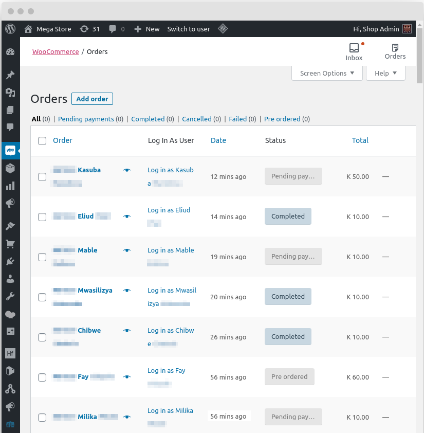

# User Switching for WooCommerce

## Description

This plugin is an extension to the "[User Switching](https://github.com/johnbillion/user-switching)" plugin. 
It adds links to the "Orders" and "Order Detail" pages of WooCommerce that allow shop managers and site admins to quickly switch to customer profiles. 
Very helpful for quickly diagnosing customer issues.

## Requirements

- [WordPress](https://wordpress.org/download/), obviously.
- [WooCommerce](https://wordpress.org/plugins/woocommerce/) installed.
- The [User Switching](https://wordpress.org/plugins/user-switching/) plugin installed.

### Optional Related

- [Admin Bar User Switching](https://github.com/wpmark/admin-bar-user-switching)

## Installation

- Upload the `woocommerce-user-switching` folder to the `/wp-content/plugins/` directory
- Activate the plugin through the 'Plugins' menu in WordPress

## Screenshot

## License

The GNU General Public License Version 2 (GPLv2). Please see [License File](LICENSE.txt) for more information.

Made with :heart: in :zambia:
